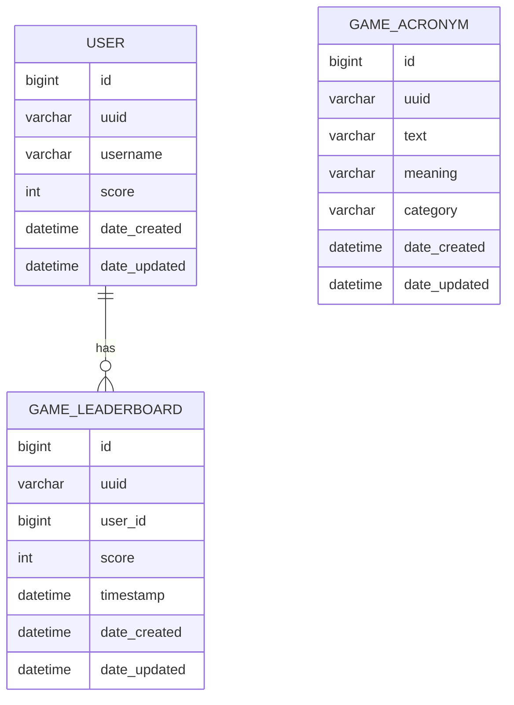

# Hexanym

A beautiful, interactive hexagonal acronym game built with Next.js, Tailwind CSS, and GibsonAI for persistent leaderboard and acronym data.

## Features
- Hexagonal grid UI with industry vertical colors
- Real-time acronym lookup and validation
- Persistent leaderboard powered by GibsonAI MySQL
- Deployed on Vercel

## Database Schema

### Mermaid ER Diagram



## Getting Started

First, run the development server:

```bash
npm run dev
# or
yarn dev
# or
pnpm dev
# or
bun dev
```

Open [http://localhost:3000](http://localhost:3000) with your browser to see the result.

You can start editing the page by modifying `app/page.tsx`. The page auto-updates as you edit the file.

This project uses [`next/font`](https://nextjs.org/docs/app/building-your-application/optimizing/fonts) to automatically optimize and load [Geist](https://vercel.com/font), a new font family for Vercel.

## Learn More

To learn more about Next.js, take a look at the following resources:

- [Next.js Documentation](https://nextjs.org/docs) - learn about Next.js features and API.
- [Learn Next.js](https://nextjs.org/learn) - an interactive Next.js tutorial.

You can check out [the Next.js GitHub repository](https://github.com/vercel/next.js) - your feedback and contributions are welcome!
****
## Deploy on Vercel

The easiest way to deploy your Next.js app is to use the [Vercel Platform](https://vercel.com/new?utm_medium=default-template&filter=next.js&utm_source=create-next-app&utm_campaign=create-next-app-readme) from the creators of Next.js.

Check out our [Next.js deployment documentation](https://nextjs.org/docs/app/building-your-application/deploying) for more details.

## Setup & Local Development

1. Clone the repo and install dependencies:
   ```sh
   git clone https://github.com/YOUR_ORG/hexaphexah.git
   cd hexaphexah
   npm install
   ```
2. Add a `.env.local` file with your Gibson credentials:
   ```env
   GIBSON_API_KEY=your_gibson_api_key
   GIBSON_API_URL=https://api.gibsonai.com/v1/-/query
   ```
3. Run locally:
   ```sh
   npm run dev
   ```

## Deployment (Vercel)
1. Push to GitHub
2. Import to Vercel
3. Set environment variables in Vercel dashboard
4. Deploy!

## Gibson API Usage
- All database operations use the REST endpoint with SQL queries and the `X-Gibson-API-Key` header.
- See `lib/db.js` for connection logic.

## Game Logic Overview
- Players enter acronyms to match hexes on the grid.
- Valid acronyms are checked against the `game_acronym` table.
- Scores and leaderboard are updated in real time.

## Development Diary
- See `/development_diary/` for a full log of progress and decisions.
